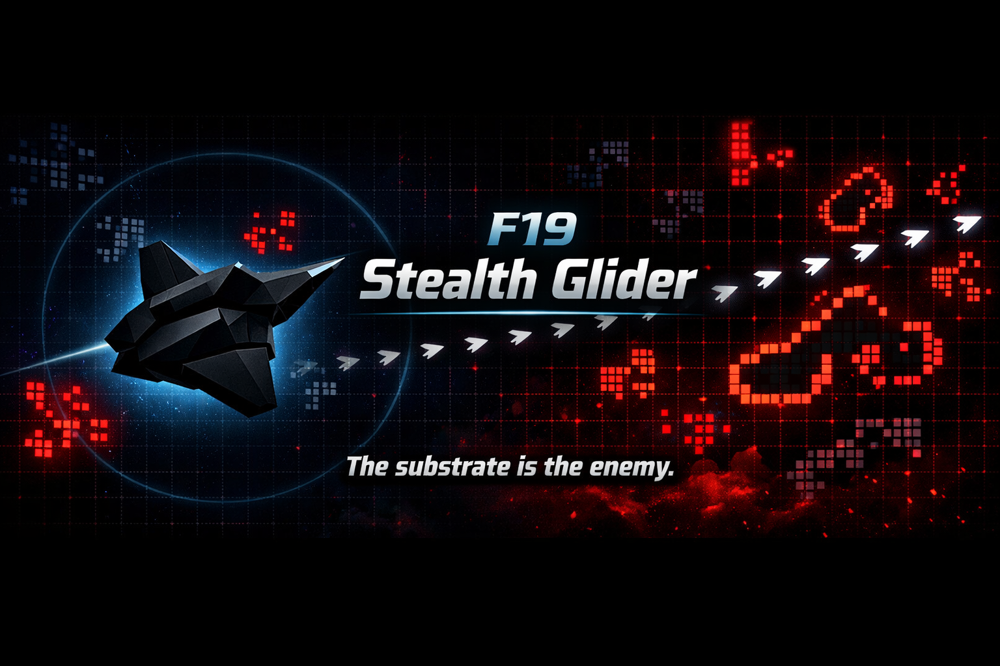

// SPDX-License-Identifier: CC-BY-SA-4.0
// Copyright (c) 2026 Jonathan D.A. Jewell <j.d.a.jewell@open.ac.uk>

= F19 Stealth Glider

[[the-substrate-is-the-enemy]]
=== _The substrate is the enemy._

*Operation Nightstep* — a stealth puzzle played on a live Conway's Game of Life field (B3/S23).

'''''

== What this is

You fly a single *glider* across a hostile cellular-automaton airspace to a hangar, without your live cells ever touching the substrate's. The threats are not scripted sprites — they are real B3/S23 patterns evolving deterministically: a *Gosper gun* firing a period-30 glider stream, eaters, and still-life terrain. Everything you must avoid obeys the same two rules the whole universe does: *born on 3 neighbours, survives on 2 or 3*.

The single fiction is a pre-contact kinematic overlay for the player glider; it is maintained only while the player is provably independent of the substrate (Chebyshev-3), and the exact criterion is documented and tested (see `VERIFICATION.adoc`).

== The premise (and its falsifier)

v0's premise is that *the substrate is load-bearing, not scenery* — the level must be unsolvable by feel and only solvable by reading the automaton's phase. The design falsifier is blunt: _if the crossing becomes learnable without tracking phase, the substrate is scenery and v0 fails._

The central geometric result (`VERIFICATION.adoc` claim #4, script `src/verify8.mjs`) is the *stream no-go lemma*: a glider cannot cleanly cross the settled p30 stream at *any* of the 30 launch phases — the glider spacing (15 units) is narrower than the crossing glider's exclusion diameter (~17 units), so no phase-gap is ever wide enough. Under a _true cell-overlap_ rule (no proximity radius), 21/30 phases still overlap outright and the remaining 9 pass only at Chebyshev-1 — an adjacency that annihilates on the next generation. *0/30 clean crossings at every phase.*

So Operation Nightstep does not ask you to cross the stream. The stream is the impassable eastern border; the only way south is a single *fence breach* whose safe lane is phase-independent by construction. The witness route lands cleanly at all 30 launch ticks with zero trace.

== Run it

* *Play in your browser:* https://metadatastician.github.io/f19-stealth-glider/
* *Play locally:* open `f19-stealth-glider.html` (self-contained, no server needed).
* *Verify:* `just test` — runs the verification ledger and rebuilds the bundle.
* *Check the contracts:* `just contracts` — executes the contractile probes.
* *Rebuild the HTML:* `just build`.

Node ≥ 18 (developed on Node 26). No dependencies — nothing to install.
Without `just`, every script runs directly: `cd src && node verify8.mjs`.

== Verification

Every design claim is discharged by a named script in `src/`, runnable with plain `node`.
See link:./VERIFICATION.adoc[`VERIFICATION.adoc`] for the full ledger. CI (`.github/workflows/ci.yml`)
runs the cited ledger (`verify1,2,3,8,9` {plus} `build`) on every push and fails on any red, and
asserts the committed `f19-stealth-glider.html` is byte-identical to a fresh rebuild.

== Documentation

[cols=",",options="header",]
|===
|Document |What it answers
|link:./VERIFICATION.adoc[`VERIFICATION.adoc`] |The 11-claim ledger. Every claim cites a script you can run. *Start here.*
|link:./ARCHITECTURE.adoc[`ARCHITECTURE.adoc`] |How the four modules fit together, and why the seams are where they are.
|link:./EXPLAINME.adoc[`EXPLAINME.adoc`] |Each claim mapped to the file and command that backs it — with the caveats.
|link:./AUDIT.adoc[`AUDIT.adoc`] |What is verified, what is merely argued, and what is _not_ claimed.
|link:./AFFIRMATION.adoc[`AFFIRMATION.adoc`] |What was checkably true at one stamped commit — including what is _not_ affirmed.
|link:./CONTRIBUTING.adoc[`CONTRIBUTING.adoc`] |How to work on this without accidentally destroying the premise.
|link:./GOVERNANCE.adoc[`GOVERNANCE.adoc`] |The design invariants, and why they outrank taste.
|link:./SECURITY.adoc[`SECURITY.adoc`] |The (deliberately small) threat model, and how to report an issue.
|link:./CHANGELOG.adoc[`CHANGELOG.adoc`] |Including what was retracted.
|===

Machine-readable metadata for agents lives in
link:./0-AI-MANIFEST.a2ml[`0-AI-MANIFEST.a2ml`] and `machine-readable/`. The
contractile probes there are *executable* — `just contracts` runs them, and
CI fails on any critical breach.

== Licence

link:./LICENSE[MPL-2.0] for code and the `.a2ml` metadata set; `CC-BY-SA-4.0` for
documentation. Relicensed from AGPL-3.0-or-later on 2026-09-02 by owner ruling. Licence texts are vendored under
link:./LICENSES[`LICENSES/`]. © 2026 Jonathan D.A. Jewell (hyperpolymath).

Contributions are accepted under the Developer Certificate of Origin 1.1 —
sign off with `git commit -s`.
